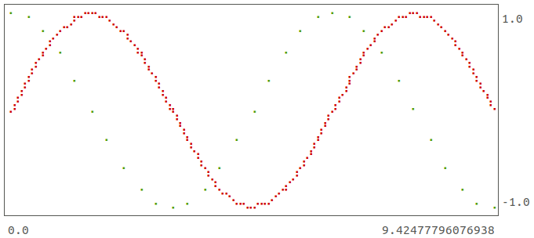

# Termplot: Make plots in the terminal

I often find myself analyzing data in Ruby. Visually representing the data
helps one find interesting angles and dig in. However, I was never satisfied
with my setup because:

* Existing plotting libraries in Ruby have shortcomings:
  * They are not designed to be used in an interactive shell; they either
    write their output to a file, or if they open a window showing the output
    it blocks further commands in the shell.
  * They have a lot of dependencies.
* Moving data between my Ruby shell (where I am doing the analysis), and another
  environment for plotting (e.g. a Python Jupyter notebook with `matplotlib`) is
  cumbersome.

`Termplot` solves the issues above by having the plots right in the terminal,
and on top of that, provides some other advantages:

* Your workflow is the same whether you are working locally or remotely over
  SSH.
* You can capture your full data analysis session with the plots using `script`.

You might think the fidelity of the terminal is not good enough to make any
use of these plots. This hasn't been my experience; using braille characters
we get 8 pixels per terminal character, and when doing data analysis I just
need something rough to get an idea of what the data is like.

## Installation

```console
$ gem install termplot
```

## Usage

```ruby
require 'termplot'

plot = Termplot::Plot.new
x = 0.step(3 * Math::PI, by: 3 * Math::PI / 30).to_a
sin = x.map { |v| Math.sin(v) }
cos = x.map { |v| Math.cos(v) }

plot.add(x, sin)
plot.add(x, cos, 'xg') # The third argument is for style and color, 'x' is to
                       # draw points not lines, 'g' is for green. This is
                       # inspired by matplotlib.
plot.draw
```

This outputs:



## Interactive Mode

While using an interactive shell, you might not want all the boiler-plate. You
can include `Termplot::Interactive` to import functions directly into the
interactive shell. Here is an example:

```
> require 'termplot'
> include Termplot::Interactive
> type :dot # By default, Termplot uses braille characters to render, but these
            # wouldn't render well in the README, so switch to the dot renderer
            # which uses dots, apostrophes, and colons.
> nocolor # Don't render with colors, we can't show the colors in README anyway.
> plot([0, 1], [0, 1])
┌────────────────────────────────────────────────────────────────────────┐
│                                                                    ..''│1
│                                                              ...'''    │ 
│                                                         ...''          │ 
│                                                    ..'''               │ 
│                                              ...'''                    │ 
│                                         ...''                          │ 
│                                    ..'''                               │ 
│                               ...''                                    │ 
│                          ..'''                                         │ 
│                    ...'''                                              │ 
│               ...''                                                    │ 
│          ..'''                                                         │ 
│     ..'''                                                              │ 
│..'''                                                                   │0
└────────────────────────────────────────────────────────────────────────┘
 0                                                                      1
> plot([0, 1], [0.5, 0])
┌──────────────────────────────────────────────────────────────────────┐
│''..                                                                  │0.5
│    '''...                                                            │   
│          ''...                                                       │   
│               ''...                                                  │   
│                    '''..                                             │   
│                         '''..                                        │   
│                              '''...                                  │   
│                                   ''...                              │   
│                                        ''...                         │   
│                                             ''...                    │   
│                                                  '''..               │   
│                                                       '''..          │   
│                                                            '''...    │   
│                                                                  ''..│0  
└──────────────────────────────────────────────────────────────────────┘
 0                                                                    1
> hold :on
> plot([0, 1], [0, 1])
┌────────────────────────────────────────────────────────────────────────┐
│                                                                    ..''│1
│                                                              ...'''    │ 
│                                                         ...''          │ 
│                                                    ..'''               │ 
│                                              ...'''                    │ 
│                                         ...''                          │ 
│                                    ..'''                               │ 
│''''''.....                    ...''                                    │ 
│           ''''''.....    ..'''                                         │ 
│                    ..:''''......                                       │ 
│               ...''             ''''.....                              │ 
│          ..'''                           ''''''.....                   │ 
│     ..'''                                           '''''......        │ 
│..'''                                                           '''''...│0
└────────────────────────────────────────────────────────────────────────┘
 0                                                                      1
> width 30
┌───────────────────────────┐
│                         .'│1
│                       .'  │ 
│                     .'    │ 
│                   .'      │ 
│                  .'       │ 
│                .'         │ 
│              .'           │ 
│'''..      .''             │ 
│     ''...'                │ 
│       .'''..              │ 
│      :      '..           │ 
│    .'          ''..       │ 
│  .'                ''..   │ 
│.'                      ''.│0
└───────────────────────────┘
 0                         1
```

## Acknowledgement

This gem heavily inspired by the
[`unicode_plot`](https://github.com/red-data-tools/unicode_plot.rb) gem.

It follows a similar overall structure, however it:
* Has cleaner more maintainable code.
* Trims some of the functionality (e.g. bar plots).
* Creates a more usable API.
* Adds the `Interactive` module.
